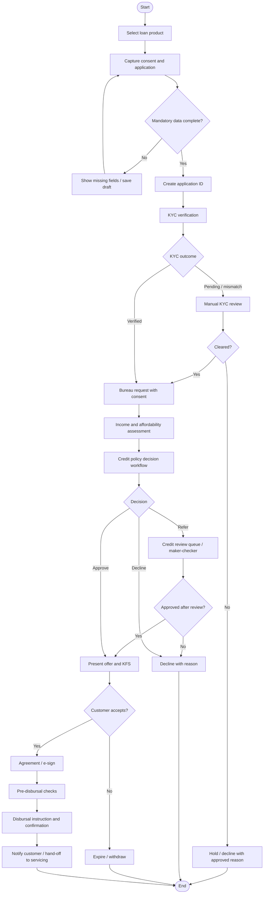

# BPMN-style process flow (Mermaid)

```mermaid
flowchart TD
 A([Start]) --> B[Select loan product]
 B --> C[Capture consent and application]
 C --> D{Mandatory data complete?}
 D -- No --> E[Show missing fields / save draft] --> C
 D -- Yes --> F[Create application ID]
 F --> G[KYC verification]
 G --> H{KYC outcome}
 H -- Pending / mismatch --> I[Manual KYC review]
 I --> J{Cleared?}
 J -- No --> K[Hold / decline with approved reason] --> Z([End])
 J -- Yes --> L[Bureau request with consent]
 H -- Verified --> L
 L --> M[Income and affordability assessment]
 M --> N[Credit policy decision workflow]
 N --> O{Decision}
 O -- Refer --> P[Credit review queue / maker-checker]
 P --> Q{Approved after review?}
 Q -- No --> R[Decline with reason] --> Z
 Q -- Yes --> S[Present offer and KFS]
 O -- Decline --> R
 O -- Approve --> S
 S --> T{Customer accepts?}
 T -- No --> U[Expire / withdraw] --> Z
 T -- Yes --> V[Agreement / e-sign]
 V --> W[Pre-disbursal checks]
 W --> X[Disbursal instruction and confirmation]
 X --> Y[Notify customer / hand-off to servicing]
 Y --> Z([End])
```
